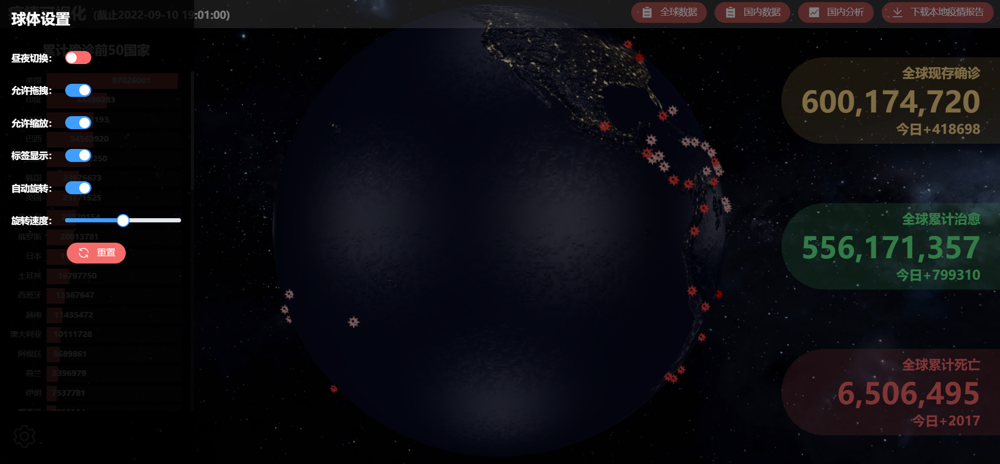
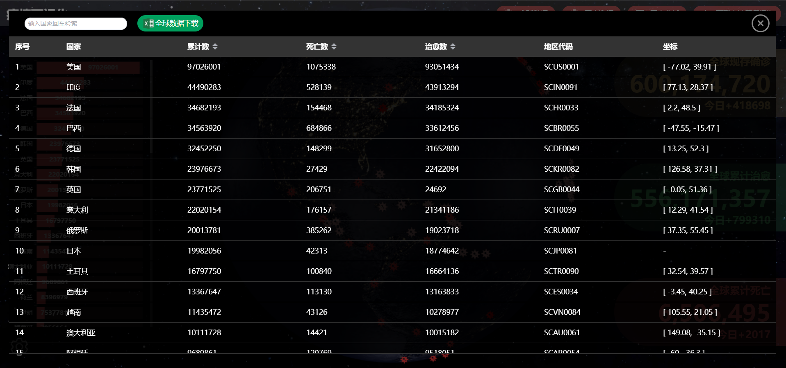
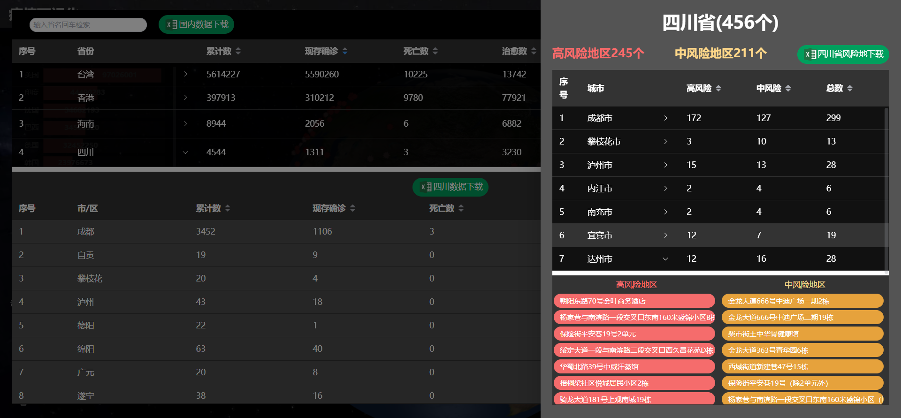
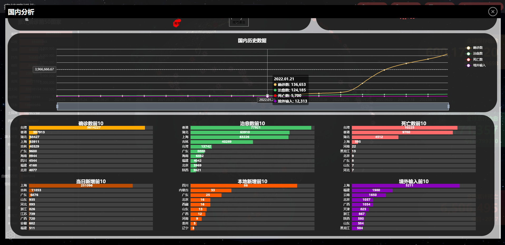

# 疫情可视化

在线链接：https://xi1213.gitee.io/covid19-visualization/#/

简介：

以3D形式查看全球疫情分布，下载全球疫情xlsx表格数据。

可查看国内疫情详情，包括省市数据以及中高风险地点数据，下载全国疫情xlsx表格数据。

可通过可视化图表分析国内疫情走向，查看国内疫情分布。

可自动识别用户所在地，下载用户当地疫情word报告(开发中)。

数据来源均为新浪的公共疫情api，实时更新。

# 技术
vue3、TypeScript、Three.js、Echarts、elementPlus。

# 项目使用

下载项目后安装依赖：npm i

运行项目：npm run serve

打包项目：npm run build

# 系统截图
疫情分布地球

地球可控

全球数据可下载

国内数据可下载

国内图表分析

