#原作者：xi1213-79
感谢大佬开源，救孩子课设于水火
下述是大佬的原readme
# 疫情可视化
* 浏览链接：https://xiblogs.top/original/bigScreen/28/index.html
* 项目链接：https://gitee.com/xi1213/covid19-visualization
* CSDN文章：https://blog.csdn.net/xi1213/article/details/126824752
# 项目简介
1. 以3D形式查看全球疫情分布。
2. 下载全球疫情excel表格数据。
3. 查看国内疫情详情。
4. 查看省市数据以及中高风险地点数据。
5. 下载全国疫情excel表格数据。
6. 可视化图表分析国内疫情走向。
7. 地图形式查看国内疫情分布。
8. 自动识别用户所在地，分析当前省份疫情数据。
9. 下载用户当地疫情word报告。
10. 系统支持自定义主题。
11. 自适应窗体尺寸。
* 说明：这是本人第一个vue3+ts的项目，肯定还有不足的地方还请指正，数据来源均为新浪的公共疫情api，真实且实时。
# 相关技术
1. vue3整体框架
2. TypeScript尝鲜
3. Three.js首页球体
4. Echarts可视化图表
5. elementPlus组件库
6. dataV大屏可视化组件
7. gsap部分动画
# 项目使用
* 安装依赖：npm i
* 修改dataV(dataV目前不兼容vue3需按此教程修改)：https://blog.csdn.net/xi1213/article/details/127697760
* 运行项目：npm run serve
* 打包项目：npm run build
# 详情说明
1. 疫情分布地球，背景为宇宙星空，球体可鼠标操控，拖拽缩放，光标移入红点会显示该国疫情数据。左侧为累计确诊前50国家，右侧为全球疫情实时总览数据，有数值增加动画。
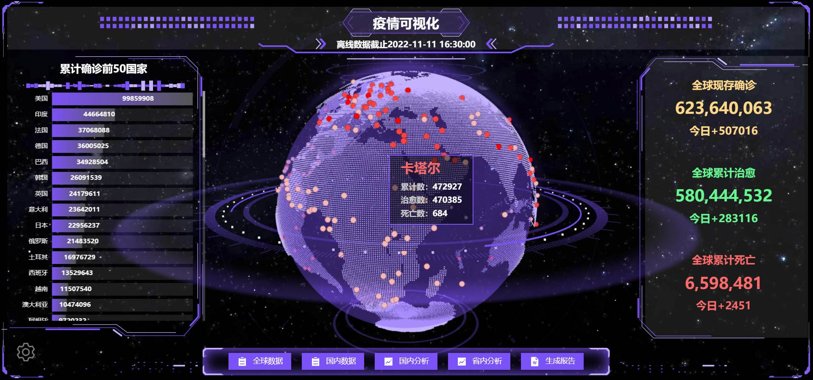
2. 系统设置中，球体可控。自动旋转开关，有拖拽控制开关，缩放控制开关，标签显示开关，数据来源切换(为防止api失效，做了离线数据备份),球体类型切换(有三种球体：粒子、白昼、黑夜，默认粒子球体)，自转速度拖动条，主题自定义(包含三种预设)，重置按钮。
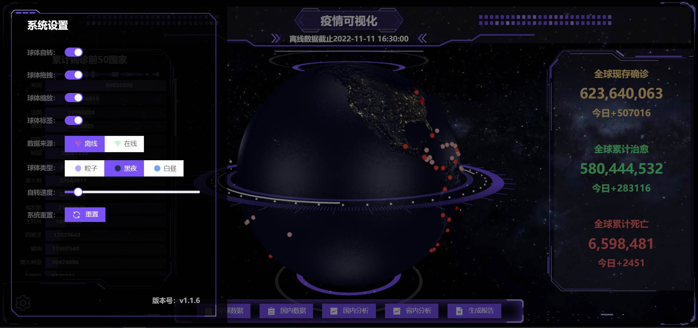
* 预设主题1。

* 预设主题2。
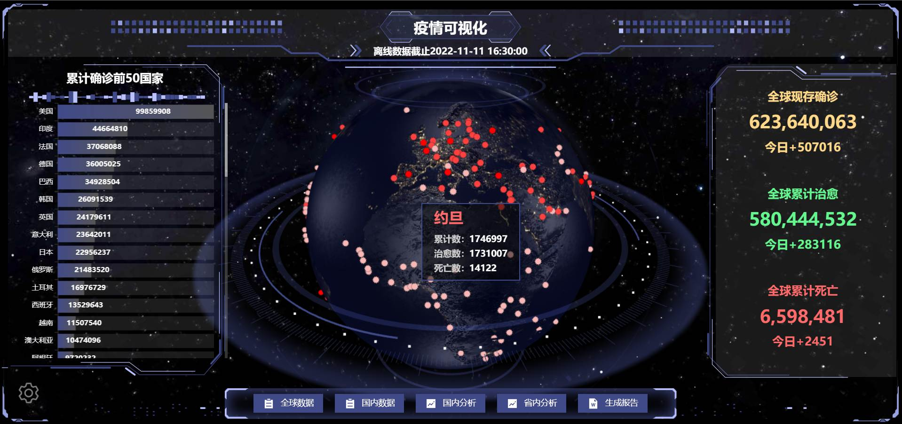
* 预设主题3。
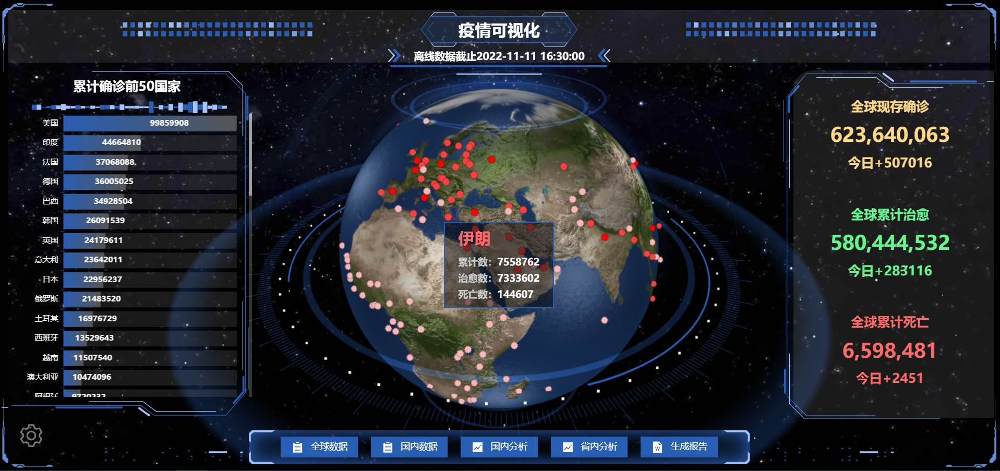
* 支持自定义主题。

3. 全球数据可下载为excel表格，本地离线查看，在线查看支持国名检索。
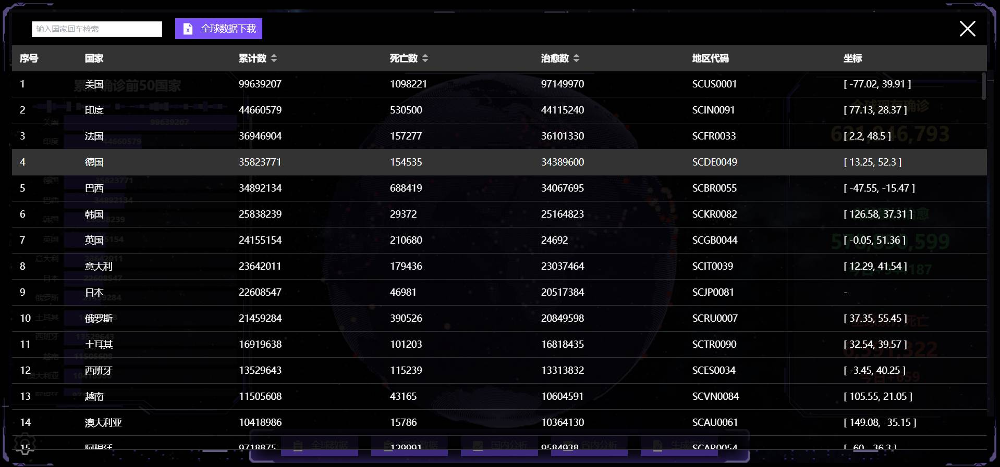
4. 国内数据可下载为excel表格，本地离线查看，在线查看支持省名检索。
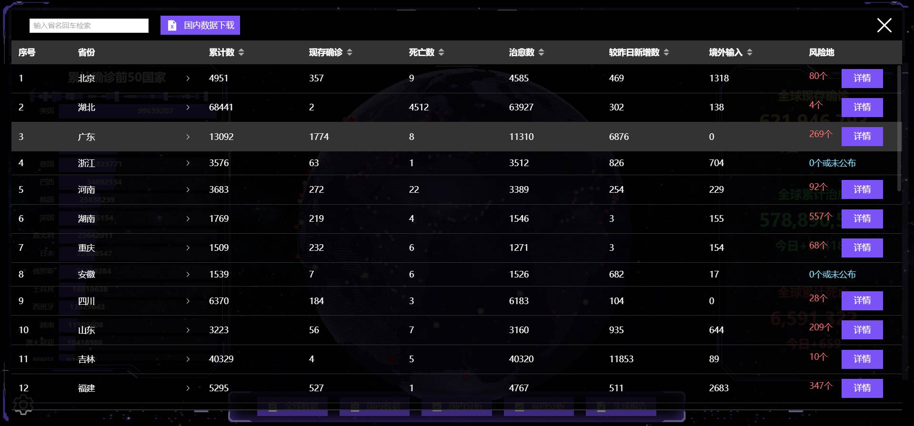
5. 国内详情数包含各省的疫情数据，包含省内中高风险地列表，点击省可查看该省下城市数据，均支持下载为excel表格。
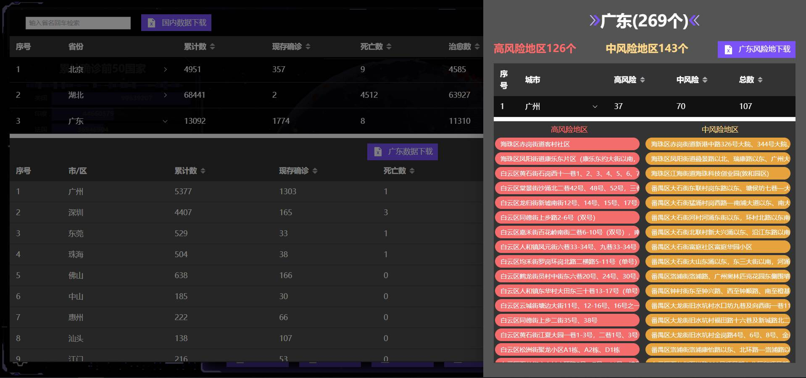
6. 国内图表分析，包含中国地图，直观展示各地疫情程度；包含国内疫情概况数据，加载时有数值增加动画。
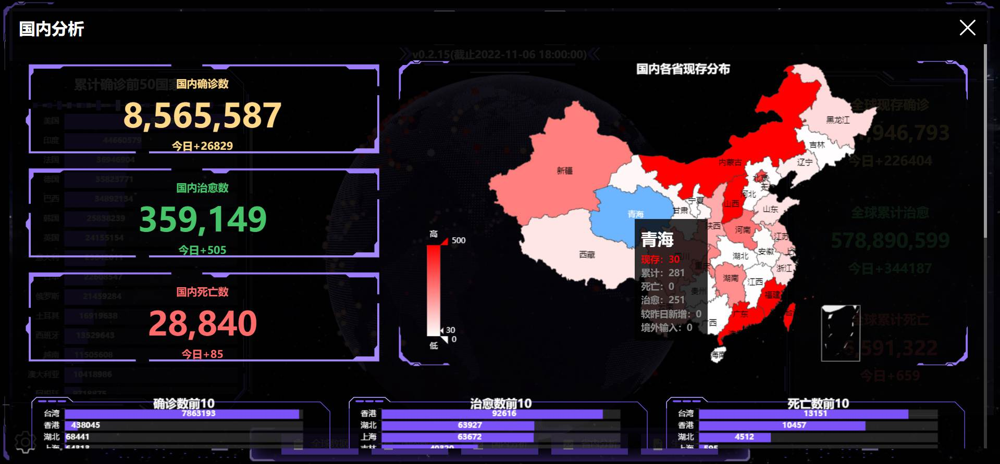
7. 图表分析中还有国内历史疫情数据折线图，支持缩放拖拽，显示不同时间点的疫情数据，下方还有六个国内的排名统计图：确诊数前10、治愈数前10、死亡数前10、当日新增前10、本地新增前10、境外输入前10。
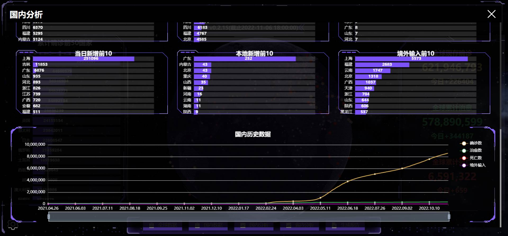
8. 省内分析包括该省数据概览、各地详情柱状图数据与表格数据、支持缩放的省内历史数据图表。
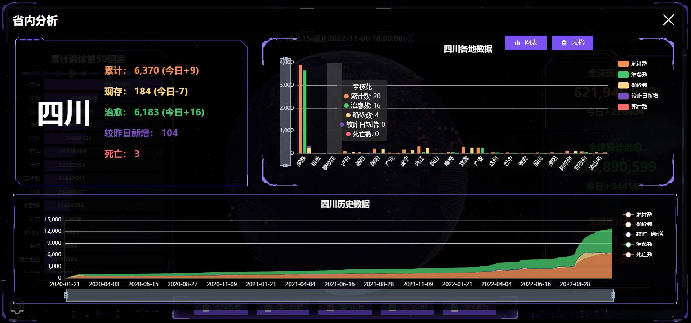
9. 可自动获取当前位置，生成当地疫情报告在线查看。
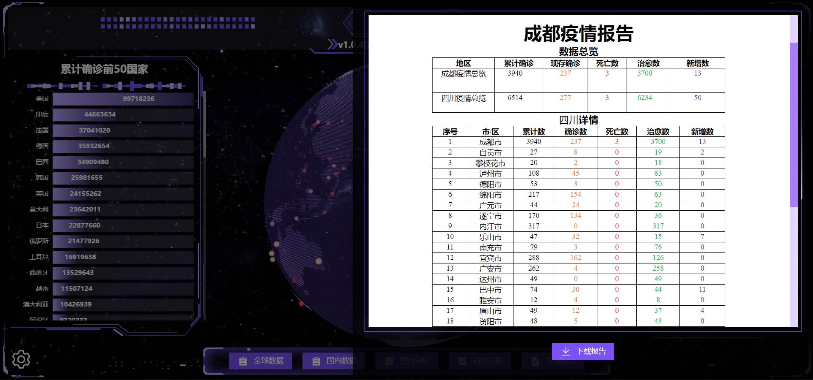
10.   生成的当地疫情报告支持离线下载。
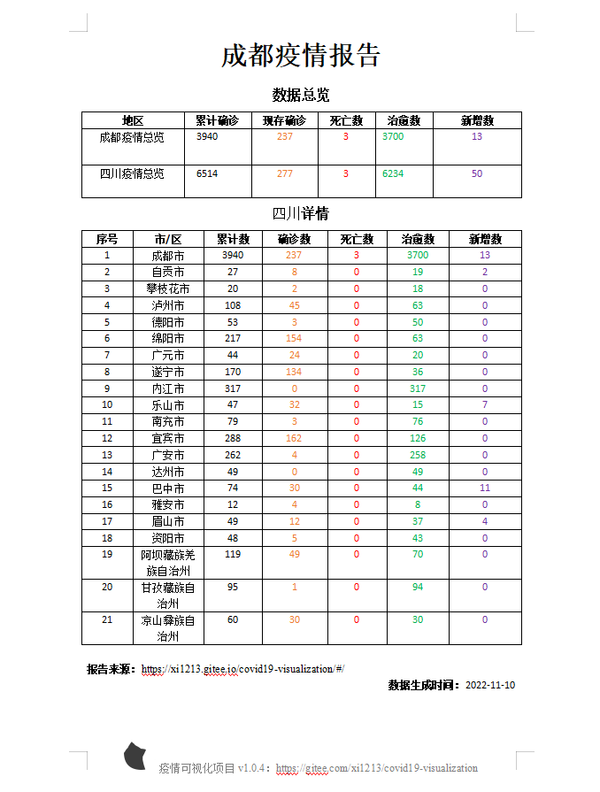
