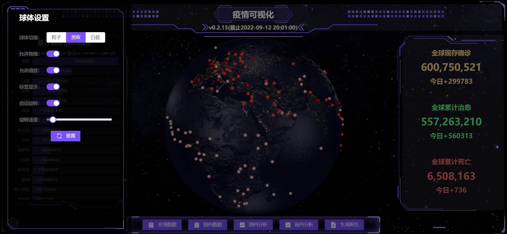

# 疫情可视化

浏览链接：https://xi1213.gitee.io/covid19-visualization/#/

CSDN文章：https://blog.csdn.net/xi1213/article/details/126824752

# 项目简介
1、以3D形式查看全球疫情分布。

2、下载全球疫情excel表格数据。

3、查看国内疫情详情。

4、查看省市数据以及中高风险地点数据。

5、下载全国疫情excel表格数据。

6、可视化图表分析国内疫情走向。

7、地图形式查看国内疫情分布。

8、自动识别用户所在地，分析当前省份疫情数据。

9、下载用户当地疫情word报告。

说明：这是本人第一个vue3+ts的项目，肯定还有不足的地方还请指正，数据来源均为新浪的公共疫情api，真实且实时。

# 相关技术
1、vue3整体框架

2、TypeScript尝鲜

3、Three.js首页地球

4、Echarts可视化图表

5、elementPlus组件库

# 项目使用

安装依赖：npm i

运行项目：npm run serve

打包项目：npm run build

# 系统截图
1、疫情分布地球，背景为宇宙星空，球体可鼠标操控，拖拽缩放，光标移入红点会显示该国疫情数据。左侧为累计确诊前50国家，右侧为全球疫情实时总览数据，有数值增加动画。

2、球体可控，可切换白昼黑夜主题，有拖拽控制的开关，缩放控制的开关，标签显示的开关、自动旋转的开关，旋转速度的滑动条，重置按钮。

3、全球数据可下载为excel表格，本地离线查看，在线查看支持国名检索。

4、国内数据可下载为excel表格，本地离线查看，在线查看支持国名检索。

5、国内详情数包含各省的疫情数据，包含省内中高风险地列表，点击省可查看该省下城市数据，均支持下载至本地查看。

6、国内图表分析，包含中国地图，直观展示各地疫情程度；包含国内疫情概况数据，加载时有数值增加动画。

7、图表分析中还有国内历史疫情数据折线图，支持缩放拖拽，显示不同时间点的疫情数据，下方还有六个国内的排名统计图：

确诊数前10、治愈数前10、死亡数前10、当日新增前10、本地新增前10、境外输入前10

8、省内分析包括该省数据概览、各地详情柱状图数据与表格数据、该省历史数据。

9、可自动获取当前位置，下载当地疫情报告。

